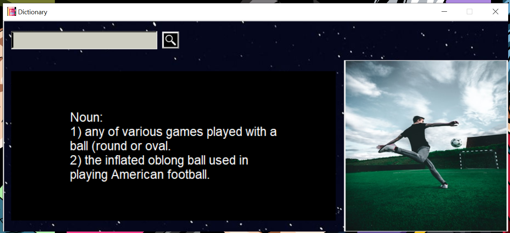

# Dictionary app
A Dictionary app that shows you meaning as well as the image of the entered word!

Used modules:
- Tkinter
- Requests
- Tkhtmlview
- Pillow (Python Imaging Library)
- PyDictionary
---

---

